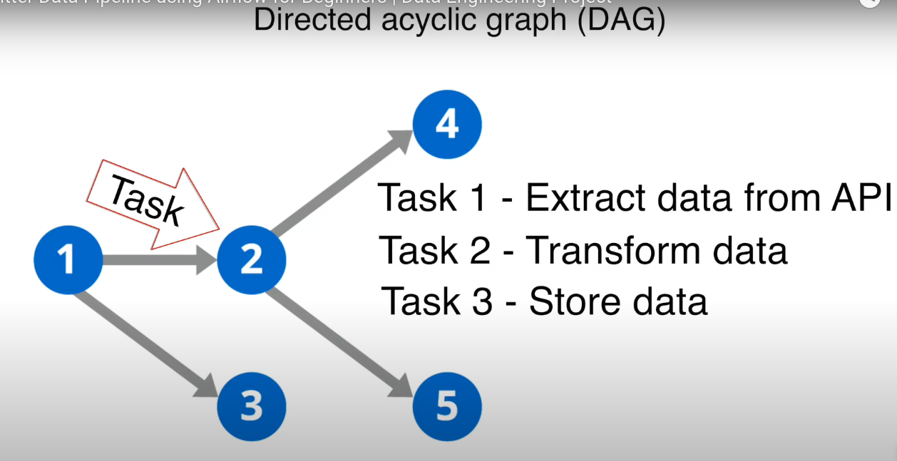

# Twitter Data ETL Pipeline

A data engineering project that extracts data from Twitter/X, processes it using Apache Airflow on AWS EC2, and stores the results in Amazon S3.

## Project Overview

This project implements an automated ETL (Extract, Transform, Load) pipeline that:
- Extracts data from Twitter using the Twitter API
- Processes the data using Apache Airflow orchestration
- Runs on AWS EC2 for scalability
- Stores processed data in Amazon S3


## Technology Stack

- **Language**: Python
- **Orchestration**: Apache Airflow (via Docker)
- **Cloud Infrastructure**: AWS EC2, Amazon S3
- **API**: Twitter API v2
- **Data Processing**: Pandas

## Setup Instructions

### 1. Environment Setup

Create a virtual environment and install dependencies:

```bash
# Create virtual environment
python -m venv venv

# Activate virtual environment
source venv/bin/activate  # On Windows: venv\Scripts\activate

# Install dependencies
pip install -r requirements.txt
```

### 2. Dependencies

The project uses the following Python packages (stored in `requirements.txt`):

```txt
pandas          # Data manipulation and analysis
tweepy          # Twitter API client (v2 support)
s3fs            # S3 file system support
apache-airflow  # Workflow management platform
python-dotenv   # Environment variable management
```

### 3. Environment Variables

Create a `.env` file to store your API credentials securely:

```env
TWITTER_CONSUMER_KEY=your_consumer_key_here
TWITTER_CONSUMER_SECRET=your_consumer_secret_here
TWITTER_ACCESS_TOKEN=your_access_token_here
TWITTER_ACCESS_TOKEN_SECRET=your_access_token_secret_here
TWITTER_BEARER_TOKEN=your_bearer_token_here
```

**Note**: The current implementation primarily uses the `TWITTER_BEARER_TOKEN` for API v2 authentication. The `.env` file is excluded from version control to keep API keys secure.

### 4. Twitter API Setup

1. Create a Twitter Developer account at [developer.twitter.com](https://developer.twitter.com)
2. Create a new app and generate API keys
3. Add the API credentials to your `.env` file

### 5. Airflow Configuration

The project uses Docker to run Apache Airflow:

```bash
# Configure and start Airflow with Docker
docker-compose up -d
```

## Project Structure

### ETL Pipeline (`etl_pipeline.py`)

The main extraction script that:
- Authenticates with Twitter API v2 using Bearer Token
- Extracts tweets from @paulkagame account (100 most recent tweets)
- Retrieves tweet metrics including likes, retweets, replies, and quotes
- Excludes retweets and replies for clean data
- Transforms raw tweet data into structured format
- Saves data locally as CSV (`kagame_tweets.csv`)
- Includes comprehensive error handling and debug logging

**Key Features:**
- Uses environment variables for secure API authentication
- Processes tweet metadata and engagement metrics
- Creates pandas DataFrame for easy data manipulation
- Provides detailed console output for monitoring

### DAG Configuration (`twitter_dag.py`)

The Directed Acyclic Graph (DAG) serves as a blueprint for the workflow:

```python
# DAG runs daily at scheduled intervals
schedule_interval=timedelta(days=1)

# Includes retry logic with 3 attempts
'retries': 3,
'retry_delay': timedelta(minutes=5)

# Single task structure
run_twitter_etl_task = PythonOperator(
    task_id='complete_twitter_etl',
    python_callable=run_twitter_etl
)
```

**Configuration Details:**
- **Owner**: 'airflow' (for team identification)
- **Schedule**: Daily execution
- **Start Date**: October 1, 2023
- **Retries**: 3 attempts with 5-minute delays
- **Tags**: ['twitter', 'etl'] for easy filtering



## Workflow Process

1. **Extract**: 
   - Authenticate with Twitter API v2 using Bearer Token
   - Look up user ID for @paulkagame
   - Fetch 100 most recent tweets (excluding retweets and replies)
   - Retrieve tweet metadata and engagement metrics

2. **Transform**: 
   - Process raw tweet data into structured format
   - Extract relevant fields: id, text, created_at, engagement metrics
   - Create pandas DataFrame for data manipulation

3. **Load**: 
   - Save processed data as CSV file locally
   - Future enhancement: Upload to Amazon S3

4. **Schedule**: 
   - Airflow DAG runs daily to maintain fresh data
   - Includes retry logic and error handling

## AWS Infrastructure

- **EC2**: Hosts the Airflow instance and runs the ETL pipeline
- **S3**: Stores the processed tweet data in a structured format
- **IAM**: Manages permissions for EC2 to access S3 resources

## Security Considerations

- API keys are stored in environment variables
- `.env` file is excluded from version control
- AWS credentials are managed through IAM roles
- All sensitive data is encrypted in transit and at rest

## File Structure

```
twitter-etl-pipeline/
├── etl_pipeline.py          # Main ETL script
├── twitter_dag.py           # Airflow DAG definition
├── requirements.txt         # Python dependencies
├── .env                     # Environment variables (not in repo)
├── kagame_tweets.csv        # Output data file
├── project_diagram.png      # Architecture diagram
├── DAG-Diagram.png         # DAG visualization
└── README.md               # This file
```

## Current Implementation Notes

- **Data Source**: Extracts tweets from @paulkagame Twitter account
- **Data Volume**: 100 most recent tweets per run
- **Filtering**: Excludes retweets and replies for cleaner dataset
- **Metrics Collected**: Like count, retweet count, reply count, quote count
- **Output Format**: CSV file with structured tweet data
- **Scheduling**: Daily execution via Airflow DAG

## Monitoring and Maintenance

- Access Airflow UI for pipeline monitoring and debugging
- Check S3 for successful data loads
- Monitor EC2 instance performance and scaling needs