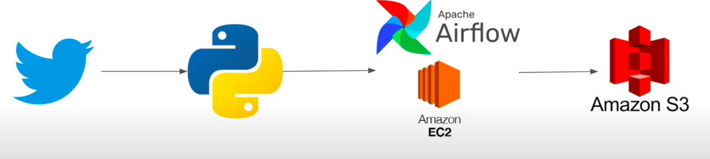

# Twitter Data Pipeline Project

## Overview
This project implements an automated data pipeline that extracts tweets from specified Twitter accounts, processes the data, and stores it in Amazon S3. The pipeline is orchestrated using Apache Airflow and runs on an Amazon EC2 instance.

## Architecture



The pipeline consists of the following components:
- **Data Extraction**: Using Twitter API v2 to extract tweets
- **Data Processing**: Transforming and cleaning the tweet data
- **Data Storage**: Storing processed data in Amazon S3
- **Orchestration**: Using Apache Airflow to schedule and monitor the pipeline
- **Infrastructure**: Running on Amazon EC2 instance

## Prerequisites
- AWS Account with access to EC2 and S3
- Twitter Developer Account with API access
- Python 3.8+
- Apache Airflow

## Setup Instructions

### 1. Setting up EC2 Instance
1. Launch an EC2 instance (recommended: t2.medium with Ubuntu)
2. Configure security groups to allow SSH (port 22) and Airflow (port 8080)
3. SSH into the instance

### 2. Environment Setup
```bash
# Update package list
sudo apt update

# Install Python and required packages
sudo apt install python3-pip python3-venv -y

# Install system dependencies
sudo apt install libpq-dev build-essential -y

# Create and activate virtual environment
python3 -m venv venv
source venv/bin/activate

# Clone the repository (if using git)
# git clone <your-repo-url>
# cd <your-repo-directory>

# Install required Python packages
pip install -r requirements.txt
```

### 3. Twitter API Configuration
Create a `.env` file in the project root with your Twitter API credentials:
```
TWITTER_CONSUMER_KEY=your_consumer_key
TWITTER_CONSUMER_SECRET=your_consumer_secret
TWITTER_ACCESS_TOKEN=your_access_token
TWITTER_ACCESS_TOKEN_SECRET=your_access_token_secret
TWITTER_BEARER_TOKEN=your_bearer_token
```

### 4. Airflow Setup
```bash
# Set Airflow home directory
export AIRFLOW_HOME=~/airflow

# Install Airflow with Amazon providers
pip install apache-airflow[amazon]

# Initialize the database
airflow db init

# Create Airflow user
airflow users create \
    --username admin \
    --firstname Admin \
    --lastname User \
    --role Admin \
    --email admin@example.com \
    --password admin

# Start Airflow webserver and scheduler in separate terminals or background
airflow webserver -p 8080 &
airflow scheduler &
```

### 5. AWS Configuration
```bash
# Install AWS CLI
pip install awscli

# Configure AWS credentials
aws configure
```

### 6. Create S3 Bucket
```bash
aws s3 mb s3://twitter-data-pipeline-bucket
```

## Project Structure
```
twitter-data-pipeline/
├── dags/
│   └── twitter_etl_dag.py
├── scripts/
│   └── etl_pipeline.py
├── requirements.txt
├── .env
└── README.md
```

## Running the Pipeline
1. Ensure Airflow is running
2. Access the Airflow UI at http://your-ec2-ip:8080
3. The DAG should be automatically loaded from the dags directory
4. Enable the DAG in the Airflow UI to start the scheduled runs

## Data Pipeline Workflow
1. Extract tweets from specified Twitter account(s)
2. Transform and clean the data
3. Convert to CSV format
4. Upload to S3 bucket
5. Log the execution details

## Monitoring and Maintenance
- Monitor DAG runs from the Airflow UI
- Check logs for any errors or warnings
- Set up email alerts for pipeline failures
- Periodically check S3 bucket for data consistency

## Troubleshooting
- **Twitter API errors**: Verify API credentials and rate limits
- **Airflow connection issues**: Check network settings and Airflow configuration
- **S3 upload failures**: Verify AWS credentials and permissions

## Future Improvements
- Add data validation steps
- Implement data partitioning in S3
- Add Spark processing for larger datasets
- Implement real-time streaming options
- Add data visualization layer